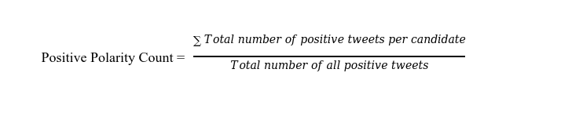

# Predicting Election Outcomes Using Sentiment Analysis And Twitter Data
Ovie Umukoro, Ashok Naren Puchakayala <br />
*Department of Computer Science, University of Bridgeport* <br />
*126 Park Avenue, Bridgeport, CT, 06604.*

## Abstract
 Elections are a quick and vivid means of identifying and
verifying the relationship between popular opinion and eventual voter's
choice. The idea is that one who speaks positively about a particular
political candidate would most likely vote for that person. Likewise,
one who speaks negatively of a particular candidate would mostly likely
not vote for that candidate as well. **

In this project, we used Tweets, which are short messages posted by
users all over the world on the social media website Twitter, in
predicting the outcome of the 2016 USA Presidential election. To
accomplish this task, we used MapReduce, Spark and Hive in performing
data analysis. The entire process involved downloading the tweets,
performing some data cleaning using Python and R to eliminate
unnecessary data, identifying the positive sentiment of each candidate
using MapReduce and lastly gathering the result using Hive.**

## I.  INTRODUCTION

In this paper, we would focus on the use of user generated big data from
Twitter in predicting election outcomes. Elections are a vivid, quick,
way of verifying opinion with intended actions. One who speaks favorably
of a specific candidate would most likely vote for that candidate and
vice versa. In essence, is user generated opinion\[1\] on social media
an accurate or approximate representation of the individual's choice? We
believe understanding emotions behind thoughts shared on social media
can help identify, validate and even uncover hidden trends. Our decision
to use Twitter as the platform of choice is straightforward. Twitter is
free, entirely open to the public and easily accessible by any
individual. Additionally, Twitter has a large active user base. As of
the last count, over two hundred (200) million active users posting over
340 million tweets per day.

## II. PROBLEM DEFINITION

Our model for predicting election outcomes is a simple one -- identify
the candidate with the highest positive sentiment rating. We decided to
model our solution with the assumption that political candidate who are
popular and well liked, statistically have a better chance of winning
the election.

To test our model, we chose the 2016 USA Presidential election for our
case study. Donald Trump representing the Republican party and Hillary
Clinton for the Democratic party were the focus of this study. We used
publicly available tweets, which are short messages posted by users all
over the world on the social media website twitter, as our data source.
Data analysis was performed on the tweets using the popular MapReduce
Programming model. The result was exported to Hive for interpretation
and further analysis.

## III. PROCESS

To accomplish our goal of election prediction, we performed the
following procedure:

A.  Gathered Tweets

B.  Analyze Tweets for Polarity values using MapReduce

C.  Exported result to Hive\[2\] for interpretation

   ### A.  TWEET COLLECTION

We chose twitter as our data source for the following reasons: Tweets
are free, publicly available and contain a diverse collection of
opinions expressed by millions of users. The choice was made with the
assumption that opinions expressed by a user on twitter is a direct
reflection of whom that specific user supports and in essence, whom the
user would vote for. Simply put, if a user constantly speaks favorably
and expresses support for a specific candidate, he is most likely to
vote for that candidate. And if the user does not speak favorably of a
candidate, he would most likely not vote for that candidate.

The tweets used for this project was downloaded live\[3\] from twitter
using the Twitter Public Streaming API Tweepy. The download was
performed using a Python Twitter Streaming program. Tweets were stored
in JSON format and were preprocessed using R language and Python to
remove all but the tweet messages and the time zone field.

The initial plan was to categorize the tweets by the various states in
the USA, as only American citizens are allowed to vote. However, we
quickly discovered that of the downloaded twitter data, only five
percent of the posted tweets had location\[4\] information. Thus, we
decided to categorize tweets according to the six available time zones
in the united states. The idea was that tweets originating from American
time zones were most likely written by Americans who can actually vote.
We understand this is an oversimplified generalization but American
tweets would most likely be posted from American time zones.

To enhance the clarity of the data, the tweet was further processed to
remove stop words, symbols and retweet tags and exported to csv files.
Furthermore, tweets were grouped into separate files and categorized per
date of download and American time zones. All tweets from non-American
time zones were ignored. This final set of tweet files based on date and
time zones were subsequently uploaded to HDFS\[5\] for storage.

### B.  ANALYZE TWEET POLARITY VALUE USING MAPREDUCE

The choice of MapReduce as the programming model for tweet analysis was
a deliberate one. Our intent was on finding a simple yet quick method
for analyzing over a million tweet. MapReduce with its speed and
reliability in processing massive data set was the only logical choice.
We used a simple algorithm for predicting the election winner. Our
assumption was the candidate with the highest number of positive
sentiment on the social media website "Twitter" would win the election.
To achieve this, we would take each tweet, count the number of positive
and negative words. If the number of positive words is greater than the
negative words, then it is a positive tweet however, if the negative
words were greater, the tweet is negative. After all the tweet
processing, the candidate with the highest number of positive tweets
wins.

To enhance speed and simplicity, the tweet analysis was divided into
three sub methods: Subject identification, polarity analysis and
collection of result. The first two were performed in the mapper while
the latter, was performed by the reducer.

### 1)  SUBJECT IDENTIFICATION

Subject identification was required to identify the subject of a
particular tweet\[6\]. In this model, we had two subjects -- Donald
Trump, the republican candidate and Hillary Clinton, the democratic
candidate. To identify the subject, we wrote a method in the mapper that
performed a keyword search. If a tweet contained keywords such as
"Hillary", "HillaryClinton" and "Democrats", it is implied that the
subject of that tweet is Hillary Clinton and thus that is an "Hillary
Tweet". We made the similar assumptions for Donald Trump as well.
However, we were careful to ignore all tweets containing both Hillary
and Trump keywords. We avoided such tweets because our method for
polarity analysis could not process complex sentences containing the
names of both candidates.

### 2)  POLARITY ANALYSIS

Polarity is simply a means of accurately measuring how people feel about
a certain candidate. Polarity can be either positive or negative. The
central idea of our prediction model was to analyze every tweet and
understand its polarity with respect to the particular candidate. To
accomplish this, we identified already existing positive and negative
word dictionaries, downloaded them into text files and created a
positive and negative dictionary in java using the hashset\[7\] data
structure. We selected the hashset data structure for its extremely fast
lookup time.*( O(1)).*

To perform the polarity analysis, we broke the tweets into individual
words and searched the negative and positive dictionary to see if those
words exist. If a word exists in the positive dictionary, we incremented
the positive word count. However, if a word was found in the negative
dictionary, we incremented the negative word count instead. Finally,
after checking all words in a given tweet, we check to see if the
positive words are greater than the negative words. If the positive
words are greater, we instruct the mapper function to emit a positive
value likewise if it is a negative word, we instruct the mapper to emit
a negative value.

Four values were selected to storing our results. They are TrumpPositve,
TrumpNegative, HillaryPositive and HillaryNegative. For example, if the
tweet is a Trump tweet and the number of positive words in the tweet is
greater than the negative words in the tweet, it is considered a
positive trump tweet and the mapper emits a {TrumpPositive, 1} key value
pair.

Algorithm of Sentiment Analysis

    If Tweet contains Trump && Hillary Keywords,
	    Ignore Tweet
    Else
	    If it's a Trump Tweet
		    If positive words > negative words
			    Return TrumpPositive
		    Else
			    Return TrumpNegative
	    If it's a Hillary Tweet
			If positive words > negative words
			    Return HillaryPositive
		    Else
			    Return HillaryNegative

### 3)  RESULT COLLECTION

The output from the mapper phase contains four key value pairs --
TrumpPositive, HillaryPositive, TrumpNegative and HillaryNegative. These
values are all shuffle and sorted and passed to the reducer. The reducer
collects all similar values and outputs the final counts to a text file
in HDFS. The text files are collected and uploaded to Hive for data
analysis.

### IV. RESULTS

The table snapshot Fig.1. below shows a brief sample of the result
exported to Hive:

<p align="center"> 
    
</p>

<p align="center"> 
    Fig.1. Snapshot of Table of data exported to Hive
</p>

The results were categorized by date of capture, time zone, polarity
count and polarity values. As previously stated, time zones were used
because only five percent of all the downloaded data had any geographic
data.

A preliminary observation in the nature of the result uncovered an
interesting fact -- Donald Trump was a much more active user of Twitter
than Hillary Clinton. According to Twitter, Trump had posted thirty
three thousand (33,000) messages while Hillary Clinton only had nine
thousand (9,000) messages. Consequently, data analysis by volume alone
would skew the result in favor of Donald Trump. Thus we decided to
analyze our results based on each individual's metric -- positive
polarity per candidate.

> A. POSITIVE POLARITY PER CANDIDATE

Positive polarity is a measure of the number of positive tweets per
candidate. To find this value, we took the total number of positive
tweets per candidate and divided it by the total number of all positive
tweets.

<p align="center"> 
    
</p>

A.1 POSITIVE POLARITY FOR HILLARY CLINTON

According to the data obtained from the sentiment analysis, Hillary
Clinton had a total of seventy-nine thousand (79,000) positive tweets
and two hundred and one thousand negative tweets culminating in a
positive polarity ratio of thirty-nine percent (39%) which is depicted
in Fig.2. The Tweet Ratio of Hillary is

<p align="center"> 
    
</p>


<p align="center"> 
    
</p>


The Positive Polarity Count of Trump is

<p align="center"> 
    
</p>


<!-- $\frac{\text{Total\ number\ of\ positive\ tweets\ for\ Trump}}{\text{Total\ number\ of\ all\ positive\ tweets}}$

$\frac{197907}{277028} = 0.714$
 -->
B.1 POSITIVE POLARITY FOR DONALD TRUMP

According to the data obtained from the sentiment analysis, Donald Trump
had a total of one hundred and ninety thousand (197,907) positive tweets
and four hundred and thirty thousand negative tweets culminating in a
positive polarity ratio of thirty nine percent (46%). This is shown in
Pie char Fig.3.

<p align="center"> 
    
</p>

<p align="center"> 
    
</p>


Similarly, the Positive Polarity of Hillary is

<p align="center"> 
    
</p>

These positive polarity values are plotted in pie chart shown in Fig.4.

<p align="center"> 
    
</p>


Finally, we calculated the tweet ratios for each candidate for every day
we collected the data and plotted it as a trend in Fig.5. to observe the
real positive trend of tweets per person.

<p align="center"> 
    
</p>


### V.  **CONCLUSION & FUTURE WORK**

In this project, we successfully proposed a technique a technique using
MapReduce and a large repository of user generated short messages called
Tweets to predict the 2016 USA Presidential election. Our approach was
to listen to the voice of the crowd by finding the candidate with most
positive rating over a one-week period. This was achieved by using
MapReduce in identifying each candidate's positive sentiment from a
large collection of Tweets.

According to results obtained from our analysis, Donald Trump had a
positive polarity ratio of 46% compared to Hillary Clinton who had a
positive polarity ratio of 39%. This lead us to the conclusion that,
based on user generated data on Twitter, Donald Trump would emerge as
the winner of the 2016 USA Presidential election.

The following are a collection of limitations experienced while
performing this project:

I.  Donald Trump was a more active Twitter user posting over thirty
    > thousand messages. That was four times the volume of Hillary
    > Clinton's message. We believe the accuracy of our model would be
    > greatly improved if both candidates had similar number of tweets.

II. Polarity analysis was limited to only tweets containing only trump
    > or Hillary keywords and not a combination of both. Over seventy
    > percent of the data extracted from twitter were ignored because
    > our current model of sentiment analysis did not account for tweets
    > with both keywords. We would encourage future work in this field
    > to perform more advanced sentiment involving tweets with multiple
    > keywords.

III. A large percentage of registered voters do not use twitter. Over
    > ninety three percent of Americans who are eligible to vote do not
    > use Twitter. More twitter users would have improved the accuracy
    > of this approach.

<!-- -->

### VI. **REFERENCES**

1\. Fink, C., et al. *Twitter, Public Opinion, and the 2011 Nigerian
Presidential Election*. in *2013 International Conference on Social
Computing*. 2013.

2\. Bhardwaj, A., et al. *Big data emerging technologies: A CaseStudy
with analyzing twitter data using apache hive*. in *2015 2nd
International Conference on Recent Advances in Engineering &
Computational Sciences (RAECS)*. 2015.

3\. Kim, H.G., S. Lee, and S. Kyeong. *Discovering hot topics using
Twitter streaming data social topic detection and geographic
clustering*. in *2013 IEEE/ACM International Conference on Advances in
Social Networks Analysis and Mining (ASONAM 2013)*. 2013.

4\. Rakesh, V., et al. *Location-specific tweet detection and topic
summarization in Twitter*. in *2013 IEEE/ACM International Conference on
Advances in Social Networks Analysis and Mining (ASONAM 2013)*. 2013.

5\. Kumar, M. and A. Bala. *Analyzing Twitter sentiments through big
data*. in *2016 3rd International Conference on Computing for
Sustainable Global Development (INDIACom)*. 2016.

6\. Batool, R., et al. *Precise tweet classification and sentiment
analysis*. in *2013 IEEE/ACIS 12th International Conference on Computer
and Information Science (ICIS)*. 2013.

7\. Kanuga, P. and A. Chauhan. *Adaptive hashing based multiple variable
length pattern search algorithm for large data sets*. in *2014
International Conference on Data Science & Engineering (ICDSE)*. 2014.
```
